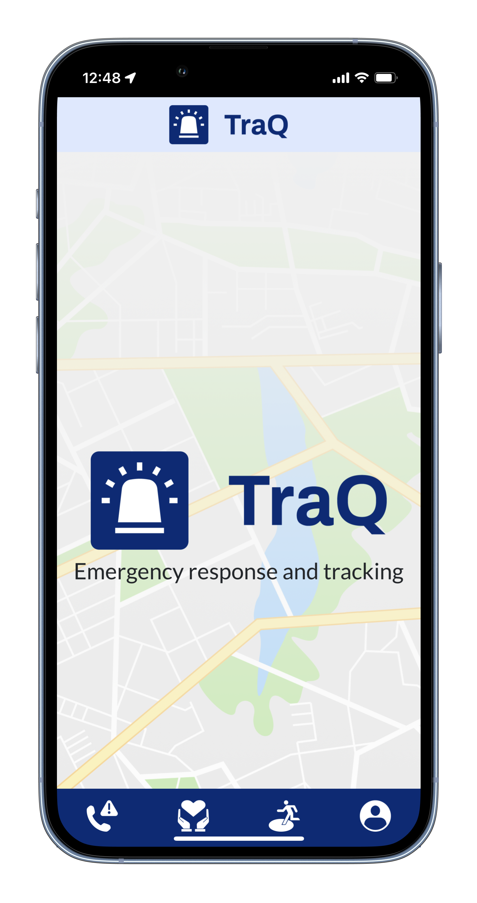
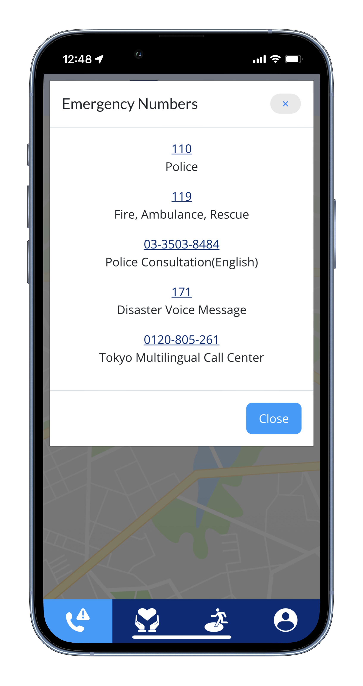
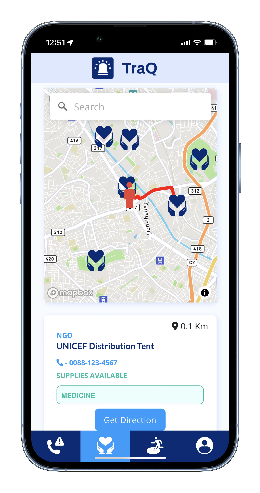
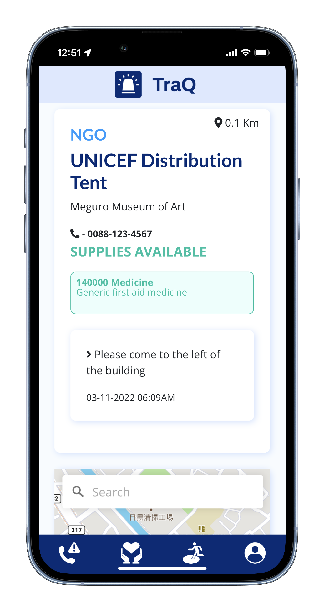
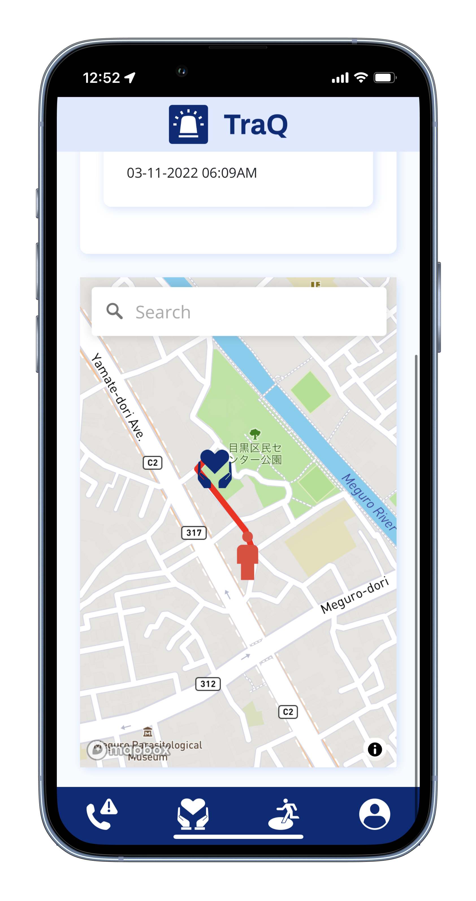
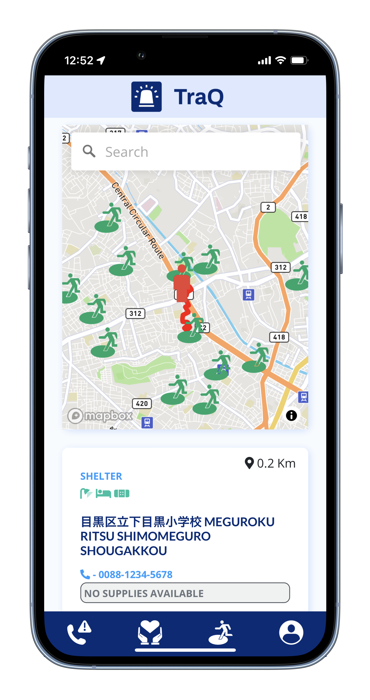

# TraQ

TraQ is an app designed to simplify emergency tracking and response. It will take your location at time of login and direct you to the nearest shelter or NGO deistribution site.

## Getting Started

Home: https://www.traq.info
Then, when prompted press 'allow' to share your location.

     

### Setup

Install gems  
`Bundle install`

Install JS Packages
`Yarn install`

ENV Variables 

Create `.env` files 

`touch .env`

Inside .env, set these variables:   

`MAPBOX_API_KEY=your_own_mapbox_api_key`

DB Setup 
`rails db:create
rails db:migrate
rails db:seed`

### How to use

As an NGO, you may create a location to let others know you are distributing supplies.
As a user who needs help during an emergency, you may click the buttons on the navbar on the bottom to search for NGO or a shelter nearby.

## Built with

* <a href= "https://www.ruby-lang.org/en/">Ruby</a> 
* <a href="https://guides.rubyonrails.org/">Rails 6</a> 
* <a href="https://sass-lang.com/documentation">SCSS</a>
* <a href="https://www.heroku.com/">Heroku</a> 
* <a href="https://html.com/">HTML</a> 
* <a href="https://www.mapbox.com/">Mapbox</a> 

## Time spent 
9 days

## Authors

* **<a href="https://github.com/ColinBertin">Colin Bertin</a> 
* **<a href="https://github.com/madebytak">Takeshi Shinohara</a> 
* **<a href="https://github.com/Sleepycatfuji"> Duangrudee Methakullachat</a> 

This project is licensed under the MIT License - see the [LICENSE.md](LICENSE.md) file for details

## Contributions
We welcome any additional suggestions for this project.
Please feel free to reach out to any of us directly if you would like to collaborate.

## Acknowledgments

* Thank you so much to Colin and Takeshi!
* Thank you all the teachers and TAs at LeWagon for your advice and guidance during the two weeks. 
* We could never have done it without you!!
